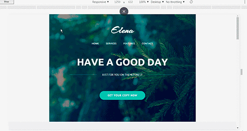

# SP-ELENA

## Описание 

Адаптивная верстка под мобильные экраны, планшеты и десктопы.

        В связи с тем что данная страница является шаблонам. Некоторые ссылки могут не работать.
## Стек технологий примененный при разработке шаблона

##  Тесты    

Протестировано на следующих браузерах. Указаны версии где шаблон работает без ограничений.

### Desktop 
|   IE  |   Edge    |   Firefox |   Chrome  |  Safari   |   Opera   |   
|-------|-----------|-----------|-----------|-----------|-----------|  
|  8    |           |    13.0   |    10.0   |     5.1   |    10.0   |
|  11   |           |    45.0   |    46.0   |     5.1   |    12.4   |
|       |           |    65.0   |    72.0   |           |    56.0   |

### Mobile 
| IOS Safari | Opera Mobile | Android Browser | Chrome for Android | Firefox for android |
|------------|--------------|-----------------|--------------------|---------------------|
|            |     53.3     |                 |         72.0       |          65.0       |

##  Валидация    
Валидацию проходит.    
Document checking completed. No errors or warnings to show.

## Tест скорости    
[https://developers.google.com/speed/](https://developers.google.com/speed/)

|  ***Для компьютеров***                    |***100%*** |        
|-------------------------------------------|----------|       
| Время загрузки первого контента           | 0,3 сек. |
| Индекс скорости загрузки                  | 1,7 сек. |
| Время загрузки для взаимодействия         | 1,3 сек. |
| Время загрузки достаточной части контента | 1,3 сек. |
| Время окончания работы ЦП                 | 1,3 сек. |
| Приблизительное время задержки при вводе  | 10 мс    |

|       ***Для мобильных***                 |***78%*** | 
|-------------------------------------------|----------|       
| Время загрузки первого контента           | 1,0 сек. |
| Индекс скорости загрузки                  | 2,3 сек. |
| Время загрузки для взаимодействия         | 5,8 сек. |
| Время загрузки достаточной части контента | 5,8 сек. |
| Время окончания работы ЦП                 | 5,8 сек. |
| Приблизительное время задержки при вводе  | 10 мс    |

##     Скриншоты шаблона

